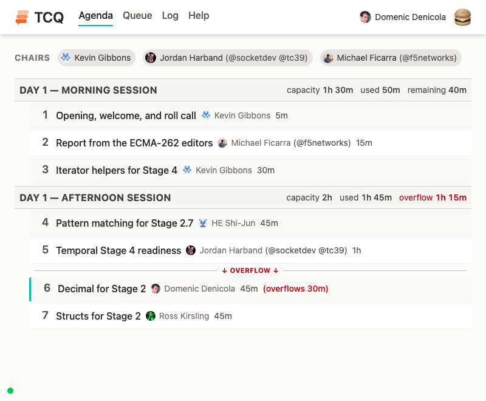

# TCQ — A Structured Meeting Queue

TCQ is a real-time web application for managing structured discussions during agenda-driven meetings. Among other things, TCQ solves the common problems caused by first-come-first-served participations systems (such as hand raising) wherein some participants have something to add to the current topic of dicussion and some participants want to begin a new topic. It does this by providing a shared queue where participants can indicate how they plan to participate, while chairs control the flow of the meeting.

## Improvements Over the Original TCQ

This project is a clean-room reimplementation inspired by [the original TCQ](https://github.com/bterlson/tcq). Notable improvements include:

### Queue interaction

- **Inline editing** — agenda items and queue entries can be edited in place without needing to delete and re-create.
- **Type cycling** — chairs can click the type badge on a queue entry to cycle through the types that are legal at that position without moving the entry.
- **Instant queue entry** ([bterlson/tcq#65](https://github.com/bterlson/tcq/issues/65)) — clicking a queue type button immediately adds you to the queue with a placeholder topic, then opens inline editing. No modal form to fill out before joining.
- **Saved topics** — a ♻️ button beside the entry-type buttons opens a dropdown of your saved queue topics. Click one and it's posted to the queue immediately — ideal for short acknowledgements like "👍 I support this. (EOM)". Each saved topic has a configurable priority (New Topic, Reply, Clarifying Question, or Point of Order), and entries whose priority isn't currently valid (such as a Reply when no topic is active) are disabled in the dropdown. Up to five topics can be saved per user (stored locally per GitHub account).
- **Participant queue self-management** ([bterlson/tcq#69](https://github.com/bterlson/tcq/issues/69)) — participants can drag their own entries downward to defer and edit their own topics inline.
- **Directional type changes** — when dragging entries, the type adjusts based on direction: moving down adopts the lowest priority of items above, moving up adopts the highest priority of items below.
- **Visual queue indicators** — point-of-order entries are highlighted with a red border and background. A user's own queue entries are shown with a teal left border.
- **Live timers** — the Queue tab shows count-up timers on the current agenda item, current topic, and current speaker. The agenda item timer turns bold red when the estimate is exceeded, and is annotated with the projected end time (e.g. "expected to end by 14:30"), switching to a relative "exceeded estimate N min ago" once the deadline passes. Active polls also display a count-up timer showing elapsed time since the poll was started.
- **Queue copy and restore** — chairs can copy the entire queue as text and paste it back later, preserving the original authors. Useful for saving and restoring queue state across breaks.
- **Confirmation on agenda advancement** — advancing to the next agenda item prompts for confirmation when the queue is non-empty, preventing accidental queue loss.
- **Queue close/open** — chairs can close the queue to prevent participants from adding new entries, then reopen it when ready. Participants can still raise a Point of Order when the queue is closed, as procedural interruptions are always permitted. The queue is closed by default before the meeting starts and automatically reopens when advancing to a new agenda item.

### Agenda and meeting structure

- **Agenda import** — chairs can import an agenda from a URL to a markdown document (e.g. a TC39 meeting agenda on GitHub). The parser extracts items from both numbered lists and markdown tables, preserving markdown formatting in item names.
- **Sessions** — chairs can interleave named session headers (with a capacity in minutes) among agenda items. Each session visually groups the contiguous run of items that follow it and shows used / remaining capacity, flipping to an "overflow" indicator when the run exceeds its budget.
- **Editable chair list** — chairs can edit the list of chairs from the Agenda tab during a meeting, adding or removing others (but not themselves).
- **Agenda item conclusions** — when advancing past an agenda item, chairs are prompted to record a free-form conclusion describing what was decided. Conclusions are saved on the item, snapshotted into the meeting log, and shown under past items in the agenda list. Revisiting a previously-concluded item pre-populates the dialogue with the saved conclusion so it can be edited or replaced.
- **Agenda prologue and epilogue** — chairs can attach free-form, sanitised-markdown sections above and below the agenda list for welcome notes, links, action items, or post-meeting reminders.

### Polls and meeting log

- **Customisable polls** ([bterlson/tcq#67](https://github.com/bterlson/tcq/pull/67)) — poll options (also known as temperature checks) are fully configurable per poll. Chairs can add, remove, and customise the emoji and label for each option, rather than being limited to a fixed set. Results can be copied to the clipboard.
- **Meeting log** — the Log tab shows a chronological timeline of meeting events: agenda items started and finished (with duration and participant summaries), speaker topics with grouped replies and clarifying questions, and poll results. Timestamps are displayed as relative times with full locale-formatted timestamps on hover.
- **Log export** — download the meeting log as a Markdown file with an automatically generated participant summary sorted by total speaking time.

### Content and display

- **Inline markdown** — agenda item names and queue entry topics support a limited subset of inline markdown: bold, italic, strikethrough, code, and links. Rendered in the UI wherever items are displayed.
- **GitHub avatars** — user avatars are shown alongside names throughout the application.
- **Username autocomplete** — every GitHub-username input (agenda presenters, chair list, dev user-switcher) shows a fuzzy-match dropdown that prioritises users already in the meeting, then members of the searcher's own GitHub organisations (including concealed members), then a fallback global GitHub user search using the searcher's OAuth credentials. Matches login, display name, and company; case-insensitive. Free-text fallback still works for presenters who don't have a GitHub account.

### General UX

- **Memorable meeting IDs** — meetings use human-readable word-based IDs (e.g. `bright-pine-lake`) instead of opaque random strings.
- **My Meetings panel** — the home page lists every meeting the current user is associated with (chair, presenter, queue speaker, or anyone who's joined) with a relative-formatted "Last Activity" column (e.g. "now", "5 min ago"), so a returning user can re-enter recent meetings without re-typing the ID and see at a glance which are in progress. Being added to the agenda by a chair is enough — the meeting shows up on the presenter's home page even before they've joined for the first time.
- **Presentation mode** ([bterlson/tcq#22](https://github.com/bterlson/tcq/issues/22)) — press `f` to enter fullscreen with all controls hidden, ideal for projecting the queue during a meeting.
- **Keyboard shortcuts** — press `?` to see the full list. Quick keys cover entering the queue (`n`, `r`, `c`, `p`), advancing the speaker (`s`), switching tabs (`1`–`4`), toggling presentation mode (`f`), and opening Preferences (`,`). Can be disabled in the Preferences modal for users who find the key bindings intrusive.
- **In-app help page** — a Help tab explains how the tool works for both chairs and participants, with guidance on when to use each queue entry type.
- **Preferences** — a Preferences modal (in the hamburger menu or via `,`) lets users enable/disable keyboard shortcuts, opt into browser notifications, and choose a colour scheme. Settings persist to `localStorage`.
- **Browser notifications** — opt in from Preferences to get alerts for major meeting events: your queue entry is next, your agenda item is coming up, the meeting has started, the agenda has advanced, a poll has opened, a clarifying question has been raised on your topic, a point of order has been raised, or the current agenda item has exceeded its time estimate. Each event has its own toggle. Permission is requested only when enabling, not on app load; if permission is revoked later, the preference self-heals back to off.
- **Dark mode** — a full dark colour palette across every view. Follows the operating system's `prefers-color-scheme` by default (switching live when the OS setting changes), and can be forced to Light or Dark via the Preferences modal.
- **Sticky navigation** ([bterlson/tcq#23](https://github.com/bterlson/tcq/issues/23)) — the navigation bar stays fixed at the top of the page when scrolling long agendas or queues.
- **Connection status indicator** — a small dot in the bottom-right corner shows green when connected to the server and red when disconnected. While connected, hovering the dot reveals the current number of active connections to the meeting.
- **Error display** — server errors are shown as a dismissible banner or a full-page error (e.g. "Meeting not found") rather than silently failing.

### Technical and developer experience

- **Race condition prevention** — advancement events use precondition checks (current speaker/agenda item ID) to prevent double-advancement when two chairs click simultaneously. On the client side, the "Next Speaker" action is debounced and enters a brief cooldown after every speaker change, so chairs cannot accidentally skip a speaker via double-clicks, double-keypresses, or clicking just as a prior advancement arrives. Reordering uses UUID-based positioning instead of array indices.
- **Admin dashboard** — admins (configured via `ADMIN_USERNAMES` env var) get a dedicated **Admin** tab on the home page (hidden from non-admin users) showing a list of all active meetings with connection statistics. Deletions are soft: a deleted meeting becomes un-joinable and disappears from users' **My Meetings**, but stays on the admin list rendered with a strikethrough and a **Restore** action until the normal 90-day retention sweep eventually purges it. A diagnostics panel alongside the meetings list shows server uptime, memory use, deployed git SHA, aggregate participant/connection counts, and the most recent ERROR/CRITICAL log entries — both panels refresh every 10 seconds so operators can triage problems without leaving the page.
- **Structured production logging** — every HTTP request, Socket.IO event, and periodic task emits a JSON line to stdout with a GCP `severity` value. HTTP entries use the `LogEntry.HttpRequest` shape so Cloud Logging renders method, URL, status, and latency as first-class fields. Authenticated entries include the acting user's GitHub id and username. Uncaught exceptions and unhandled promise rejections are logged at `CRITICAL` before the process exits so the instance can be recycled cleanly.
- **Mock auth mode** — a built-in dev user-switcher allows testing with multiple identities without configuring GitHub OAuth.
- **Modern, familiar tech stack** — built with React, Vite, Tailwind CSS, Express, and Socket.IO — widely known technologies that lower the contribution barrier. TypeScript throughout with strict mode.
- **Easy local development** — `npm install && npm run dev` is all that's needed to start developing. No Docker, no external databases, no OAuth setup required. Mock auth is automatic. A seed script populates a meeting with sample data for quick testing. An extensive test suite covers server logic, socket events, permissions, and UI components — see [`docs/TESTING.md`](docs/TESTING.md) for a breakdown of each suite.
- **Easy production deployment** — `scripts/deploy.sh` is an interactive, idempotent bootstrap. The first run prompts for project details and provisions everything needed on Google Cloud (project, billing, APIs, Firestore, service accounts, Artifact Registry) — no hand-running `gcloud` commands, and partial progress survives Ctrl-C. Subsequent deploys are a single zero-prompt command: build, push, deploy.
- **Well documented** — comprehensive docs covering [local development](docs/CONTRIBUTING.md), [production deployment](docs/DEPLOYMENT.md), [architecture decisions](docs/ARCHITECTURE.md), and a complete [product requirements document](docs/PRD.md).

## Screenshots

<figure>
<figcaption>Join or create a meeting from the home page.</figcaption>

</figure>

<figure>
<figcaption>The speaker queue with priority-ordered entries from a participant's perspective.</figcaption>

</figure>

<figure>
<figcaption>The speaker queue with chair controls.</figcaption>

</figure>

<figure>
<figcaption>Dark mode follows the system colour scheme by default, and can be overridden in the Preferences modal.</figcaption>

</figure>

<figure>
<figcaption>The agenda tab with chairs, numbered items, and drag-to-reorder.</figcaption>

</figure>

<figure>
<figcaption>Sessions group a contiguous run of agenda items by capacity. Each session header shows capacity, used, and remaining (or overflow when the run exceeds its budget).</figcaption>

</figure>

<figure>
<figcaption>Press <code>?</code> to view all keyboard shortcuts.</figcaption>

</figure>

<figure>
<figcaption>Configuring a poll with customisable emoji and label options.</figcaption>

</figure>

<figure>
<figcaption>An active poll showing reaction buttons with counts.</figcaption>

</figure>

<figure>
<figcaption>The log tab showing a timeline of meeting events with speaker topics and durations.</figcaption>

</figure>

<figure>
<figcaption>Built-in help page explaining the tool for participants and chairs.</figcaption>

</figure>

## Tech Stack

TCQ is written in strict mode TypeScript 6 throughout, organised as three npm workspaces. The client is a React 19 single-page app built with Vite 8, styled with Tailwind CSS 4, and uses React Router 7 for navigation. The server runs on Node.js 24 with Express 5 and pushes real-time updates over Socket.IO 4 (using MessagePack encoding), backed by express-session for login state. A shared workspace holds the Zod 4 schemas and the unified/remark/rehype markdown pipeline that both ends rely on. Authentication is via GitHub OAuth, and persistent state lives in Google Cloud Firestore. Tests run under Vitest 4 (unit and integration) and Playwright (end-to-end), with ESLint 10 and Prettier 3 enforcing style and SVGO and oxipng optimising image assets.

In production, TCQ runs as Docker containers on a Google Compute Engine VM (Container-Optimized OS), with Caddy 2 in front of it for automatic Let's Encrypt HTTPS and systemd keeping the processes alive. Container images are served from Artifact Registry.

## Quick Start

See [docs/CONTRIBUTING.md](docs/CONTRIBUTING.md) for local development setup.

See [docs/DEPLOYMENT.md](docs/DEPLOYMENT.md) for production deployment instructions.
