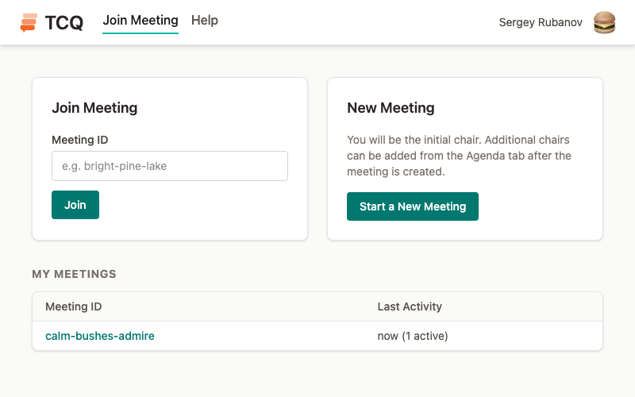
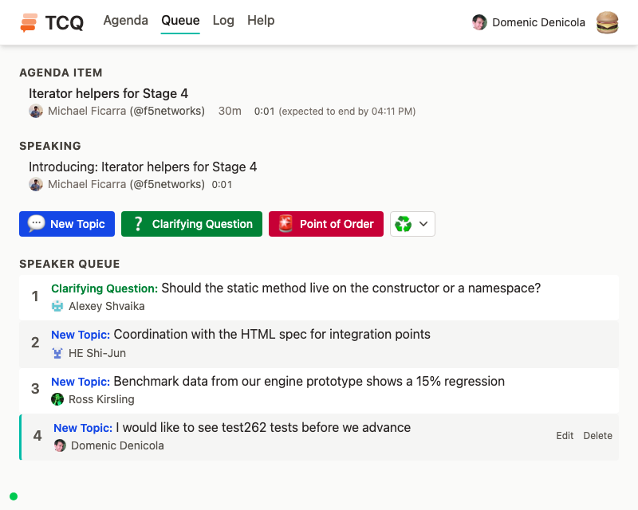
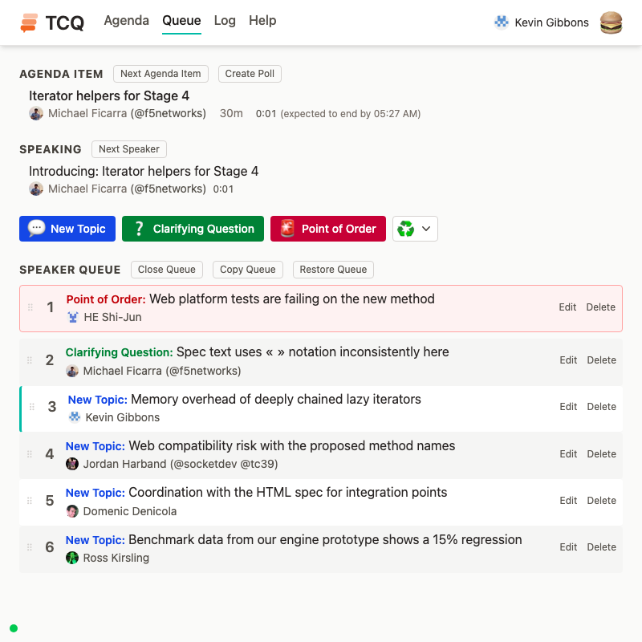
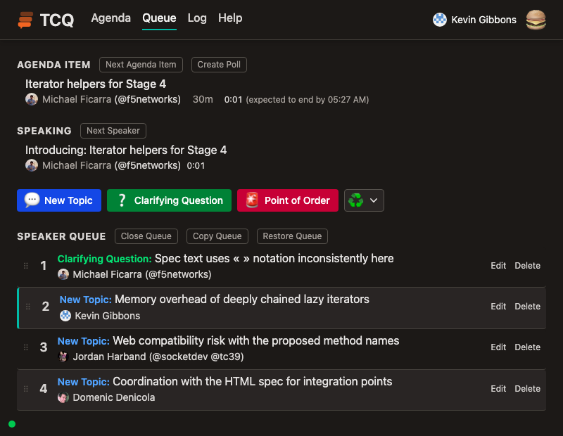
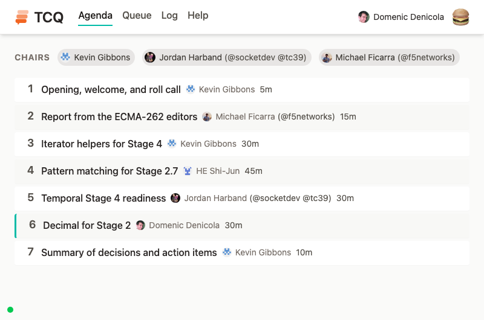
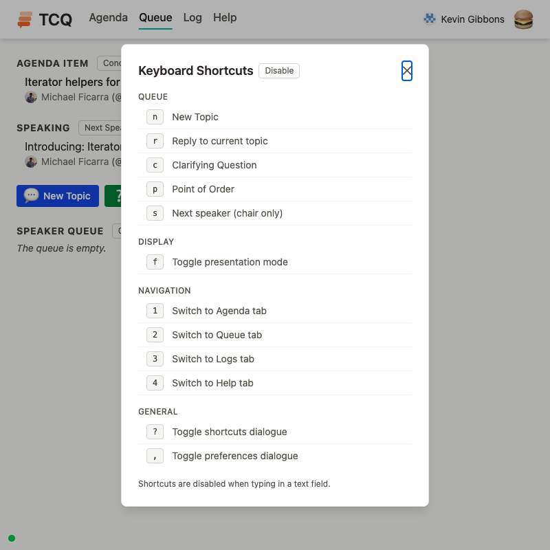
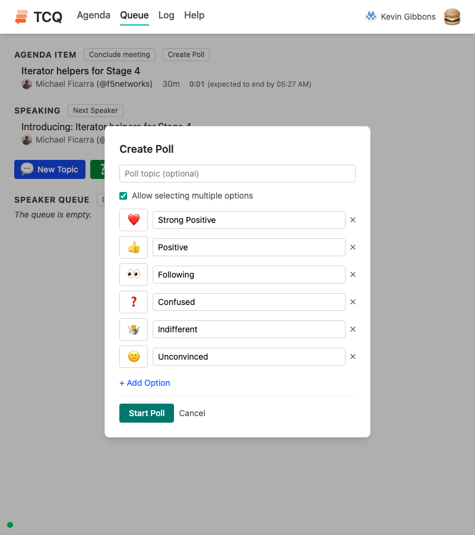
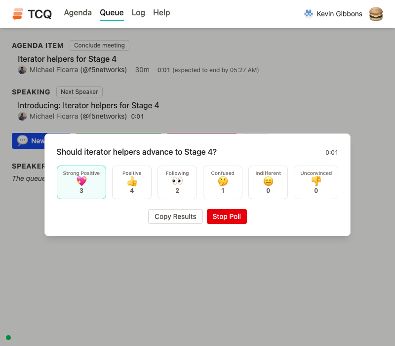
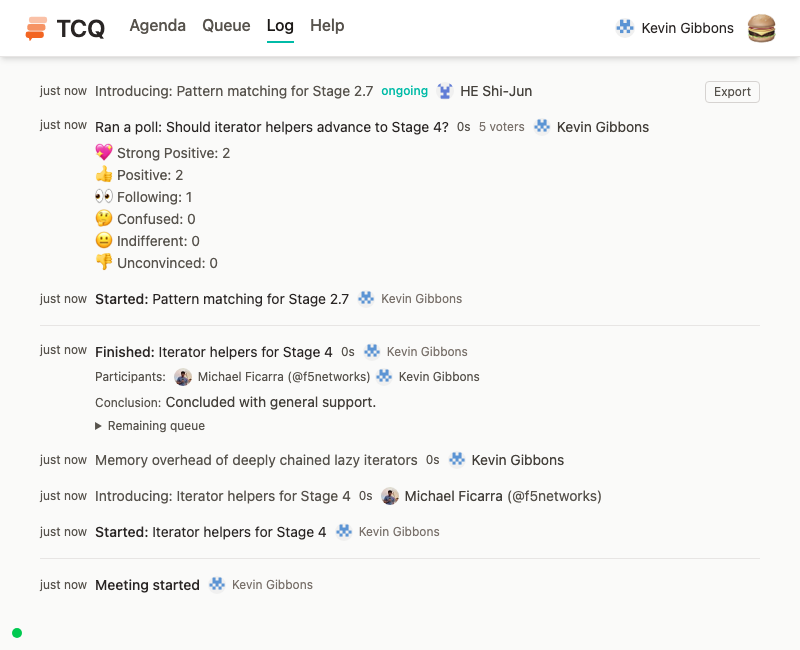
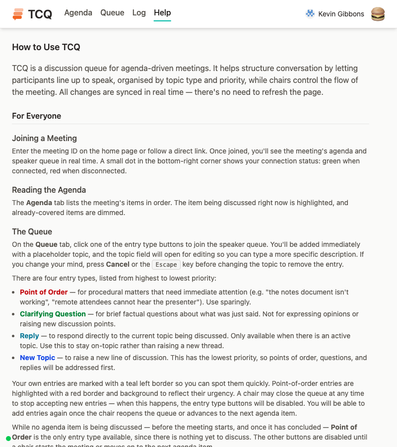

# TCQ — A Structured Meeting Queue

TCQ is a real-time web application for managing structured discussions during agenda-driven meetings. It provides a shared queue where participants can line up to speak, organised by topic type and priority, while chairs control the flow of the meeting.

## Improvements Over the Original TCQ

This project is a clean-room reimplementation inspired by [the original TCQ](https://github.com/bterlson/tcq). Notable improvements include:

### Queue interaction

- **Inline editing** — agenda items and queue entries can be edited in place without needing to delete and re-create.
- **Type cycling** — chairs can click the type badge on a queue entry to cycle through the types that are legal at that position without moving the entry.
- **Instant queue entry** ([bterlson/tcq#65](https://github.com/bterlson/tcq/issues/65)) — clicking a queue type button immediately adds you to the queue with a placeholder topic, then opens inline editing. No modal form to fill out before joining.
- **Participant queue self-management** ([bterlson/tcq#69](https://github.com/bterlson/tcq/issues/69)) — participants can drag their own entries downward to defer and edit their own topics inline.
- **Directional type changes** — when dragging entries, the type adjusts based on direction: moving down adopts the lowest priority of items above, moving up adopts the highest priority of items below.
- **Visual queue indicators** — point-of-order entries are highlighted with a red border and background. A user's own queue entries are shown with a teal left border.
- **Live timers** — the Queue tab shows count-up timers on the current agenda item, current topic, and current speaker. The agenda item timer turns bold red when the timebox is exceeded. Active polls also display a count-up timer showing elapsed time since the poll was started.
- **Queue copy and restore** — chairs can copy the entire queue as text and paste it back later, preserving the original authors. Useful for saving and restoring queue state across breaks.
- **Confirmation on agenda advancement** — advancing to the next agenda item prompts for confirmation when the queue is non-empty, preventing accidental queue loss.
- **"I'm done speaking"** — when a non-chair participant is the active speaker, an "I'm done speaking" button lets them voluntarily yield without waiting for a chair to click "Next Speaker". This uses the same race condition prevention strategies as the chairs' "Next Speaker" button.
- **Queue close/open** — chairs can close the queue to prevent participants from adding new entries, then reopen it when ready. Participants can still raise a Point of Order when the queue is closed, as procedural interruptions are always permitted. The queue is closed by default before the meeting starts and automatically reopens when advancing to a new agenda item.

### Agenda and meeting structure

- **Agenda import** — chairs can import an agenda from a URL to a markdown document (e.g. a TC39 meeting agenda on GitHub). The parser extracts items from both numbered lists and markdown tables, preserving markdown formatting in item names.
- **Editable chair list** — chairs can edit the list of chairs from the Agenda tab during a meeting, adding or removing others (but not themselves).

### Polls and meeting log

- **Customisable polls** ([bterlson/tcq#67](https://github.com/bterlson/tcq/pull/67)) — poll options (also known as temperature checks) are fully configurable per poll. Chairs can add, remove, and customise the emoji and label for each option, rather than being limited to a fixed set. Results can be copied to the clipboard.
- **Meeting log** — the Log tab shows a chronological timeline of meeting events: agenda items started and finished (with duration and participant summaries), speaker topics with grouped replies and clarifying questions, and poll results. Timestamps are displayed as relative times with full locale-formatted timestamps on hover.
- **Log export** — download the meeting log as a Markdown file with an automatically generated participant summary sorted by total speaking time.

### Content and display

- **Inline markdown** — agenda item names and queue entry topics support a limited subset of inline markdown: bold, italic, strikethrough, code, and links. Rendered in the UI wherever items are displayed.
- **GitHub avatars** — user avatars are shown alongside names throughout the application.

### General UX

- **Memorable meeting IDs** — meetings use human-readable word-based IDs (e.g. `bright-pine-lake`) instead of opaque random strings.
- **Presentation mode** ([bterlson/tcq#22](https://github.com/bterlson/tcq/issues/22)) — press `f` to enter fullscreen with all controls hidden, ideal for projecting the queue during a meeting.
- **Keyboard shortcuts** — press `?` to see the full list. Quick keys cover entering the queue (`n`, `r`, `c`, `p`), advancing the speaker (`s`), switching tabs (`1`–`4`), toggling presentation mode (`f`), and opening Preferences (`,`). Can be disabled in the Preferences modal for users who find the key bindings intrusive.
- **In-app help page** — a Help tab explains how the tool works for both chairs and participants, with guidance on when to use each queue entry type.
- **Preferences** — a Preferences modal (in the hamburger menu or via `,`) lets users enable/disable keyboard shortcuts, opt into browser notifications, and choose a colour scheme. Settings persist to `localStorage`.
- **Browser notifications** — opt in from Preferences to get alerts for major meeting events: your queue entry is next, your agenda item is coming up, the meeting has started, the agenda has advanced, a poll has opened, a clarifying question has been raised on your topic, a point of order has been raised, or the current agenda item has exceeded its time estimate. Each event has its own toggle. Permission is requested only when enabling, not on app load; if permission is revoked later, the preference self-heals back to off.
- **Dark mode** — a full dark colour palette across every view. Follows the operating system's `prefers-color-scheme` by default (switching live when the OS setting changes), and can be forced to Light or Dark via the Preferences modal.
- **Sticky navigation** ([bterlson/tcq#23](https://github.com/bterlson/tcq/issues/23)) — the navigation bar stays fixed at the top of the page when scrolling long agendas or queues.
- **Connection status indicator** — a small dot in the bottom-right corner shows green when connected to the server and red when disconnected.
- **Error display** — server errors are shown as a dismissible banner or a full-page error (e.g. "Meeting not found") rather than silently failing.

### Technical and developer experience

- **Race condition prevention** — advancement events use precondition checks (current speaker/agenda item ID) to prevent double-advancement when two chairs click simultaneously. On the client side, the "Next Speaker" action is debounced and enters a brief cooldown after every speaker change, so chairs cannot accidentally skip a speaker via double-clicks, double-keypresses, or clicking just as a prior advancement arrives. Reordering uses UUID-based positioning instead of array indices.
- **Admin dashboard** — admins (configured via `ADMIN_USERNAMES` env var) see a list of all active meetings on the home page with connection statistics, and can delete meetings.
- **Mock auth mode** — a built-in dev user-switcher allows testing with multiple identities without configuring GitHub OAuth.
- **Modern, familiar tech stack** — built with React, Vite, Tailwind CSS, Express, and Socket.IO — widely known technologies that lower the contribution barrier. TypeScript throughout with strict mode.
- **Easy local development** — `npm install && npm run dev` is all that's needed to start developing. No Docker, no external databases, no OAuth setup required. Mock auth is automatic. A seed script populates a meeting with sample data for quick testing. An extensive test suite covers server logic, socket events, permissions, and UI components.
- **Well documented** — comprehensive docs covering [local development](docs/CONTRIBUTING.md), [production deployment](docs/DEPLOYMENT.md), [architecture decisions](docs/ARCHITECTURE.md), and a complete [product requirements document](docs/PRD.md).

## Screenshots

Join or create a meeting from the home page.

The speaker queue with priority-ordered entries from a particpant's perspective.

The speaker queue with chair controls.

Dark mode follows the system colour scheme by default, and can be overridden in the Preferences modal.

The agenda tab with chairs, numbered items, and drag-to-reorder.

Press `?` to view all keyboard shortcuts.

Configuring a poll with customisable emoji and label options.

An active poll showing reaction buttons with counts.

The log tab showing a timeline of meeting events with speaker topics and durations.

Built-in help page explaining the tool for participants and chairs.

## Quick Start

See [docs/CONTRIBUTING.md](docs/CONTRIBUTING.md) for local development setup.

See [docs/DEPLOYMENT.md](docs/DEPLOYMENT.md) for production deployment instructions.
